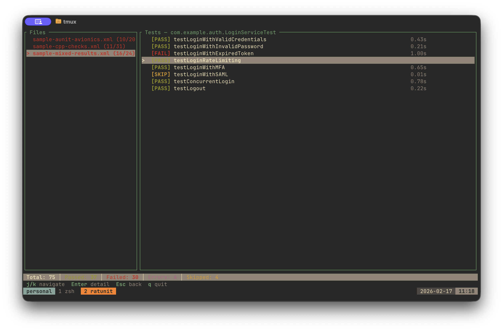
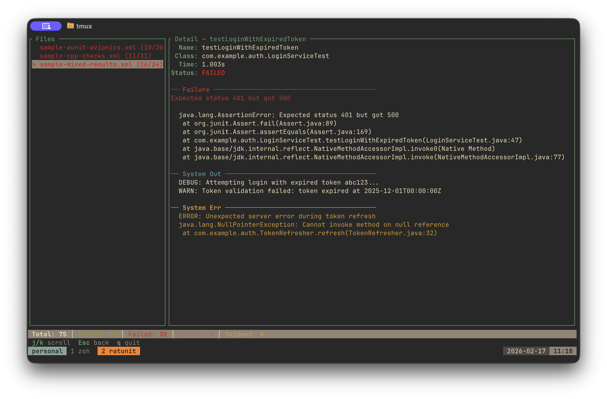

# ratunit 🐀

A rat-powered TUI for viewing JUnit XML test reports.

Browse test suites, drill into failures, read stack traces — all from your terminal.




## Install

**Homebrew**
```
brew tap rupert648/tap
brew install ratunit
```

**Cargo**
```
cargo install --git https://github.com/rupert648/ratunit.git ratunit
```

**From source**
```
git clone https://github.com/rupert648/ratunit.git
cd ratunit
cargo install --path crates/ratunit
```

## Usage

```
ratunit report.xml             # view a single file
ratunit test-reports/          # view a directory of XML files
```

## Keybindings

| Key | Action |
|-----|--------|
| `j` / `k` | Navigate up / down |
| `Enter` | Drill into suite or test |
| `Esc` | Go back |
| `Tab` / `Shift+Tab` | Switch between files |
| `g` / `G` | Jump to first / last |
| `q` | Quit |

## Project Structure

```
crates/
├── junit-parser/    # Standalone JUnit XML parsing library
└── ratunit/         # TUI viewer binary
```

The parser crate can be used independently in your own projects.
